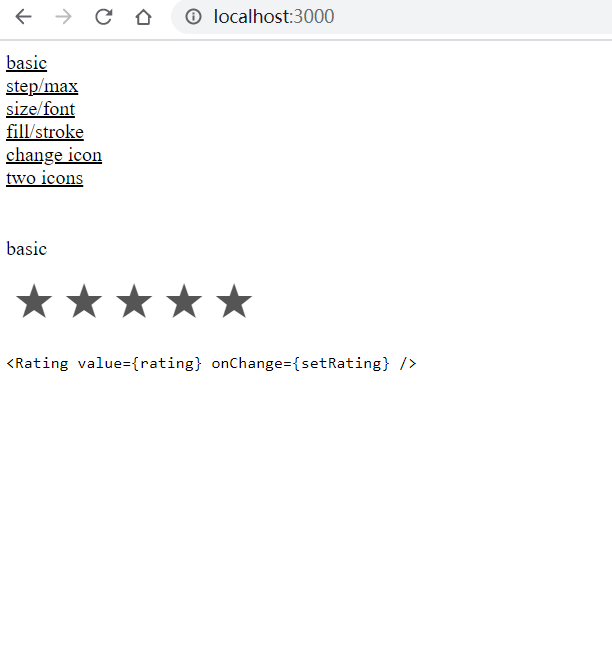

# react-single-element-rating

单元素实现评星组件 | rating component with single element



## 使用 | usage

```
import { useState } from "react"
import Rating from 'react-single-element-rating'

const BasicRating = () => {
  let [rating, setRating] = useState(0)
  return (<Rating value={rating} onChange={setRating} />)
}

export default BasicRating
```

## 示例 | examples

codes:

[`examples/basic/comps`](./examples/basic/comps)

run:

```
git clone https://github.com/postor/react-single-element-rating
cd react-single-element-rating/examples/basic
npm run dev
```